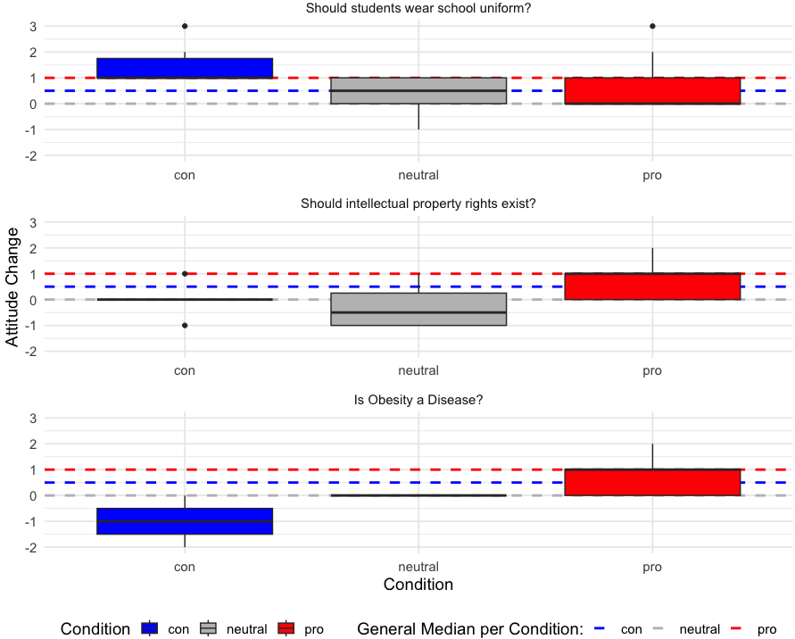
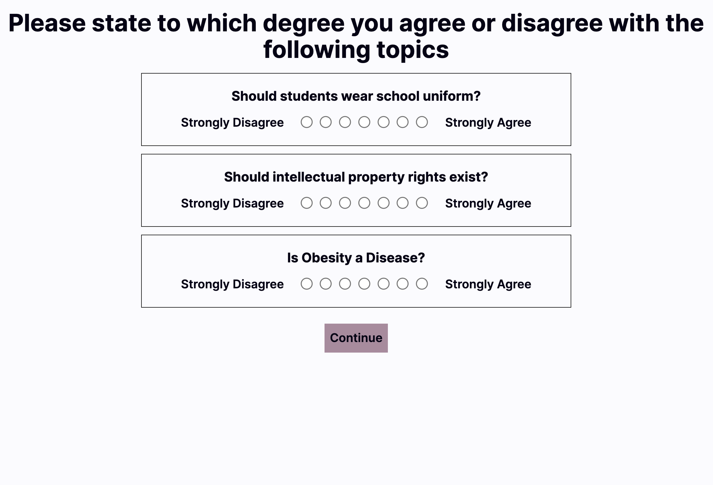
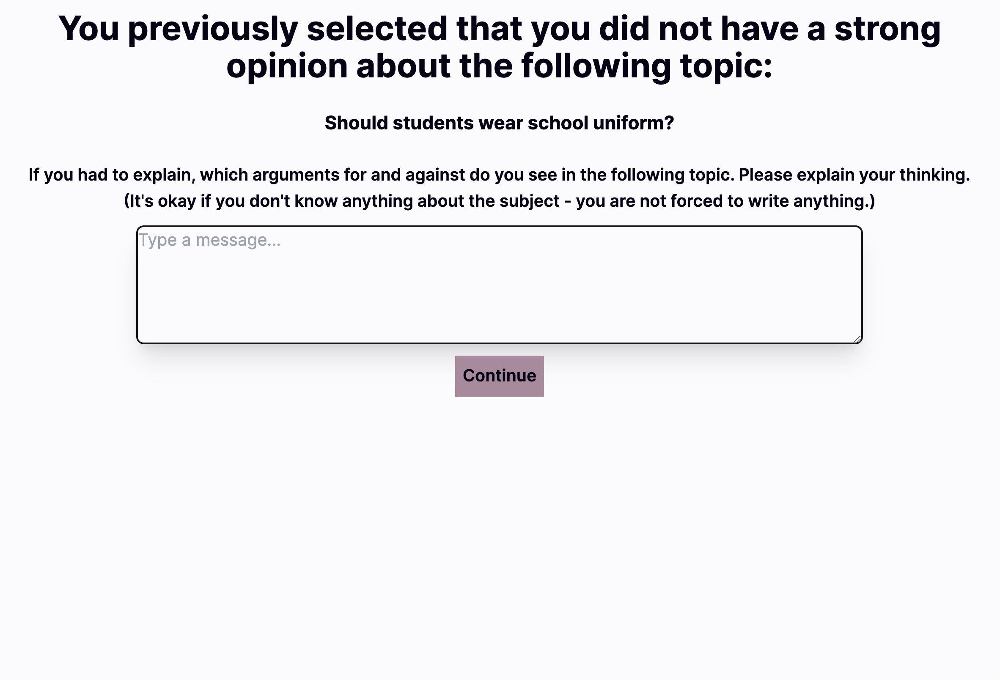
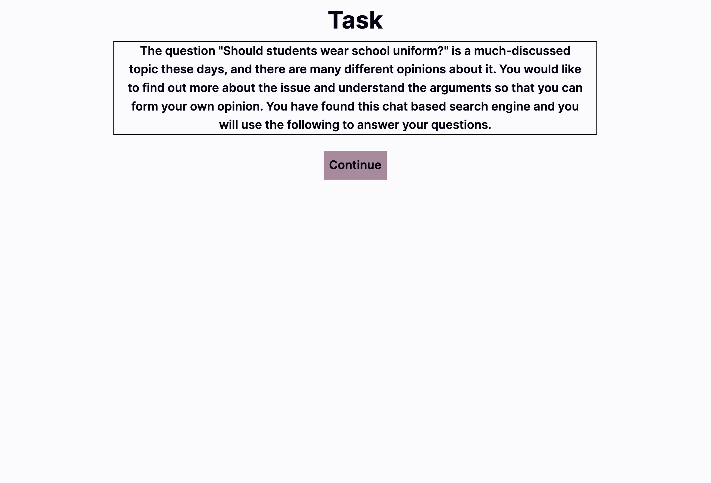
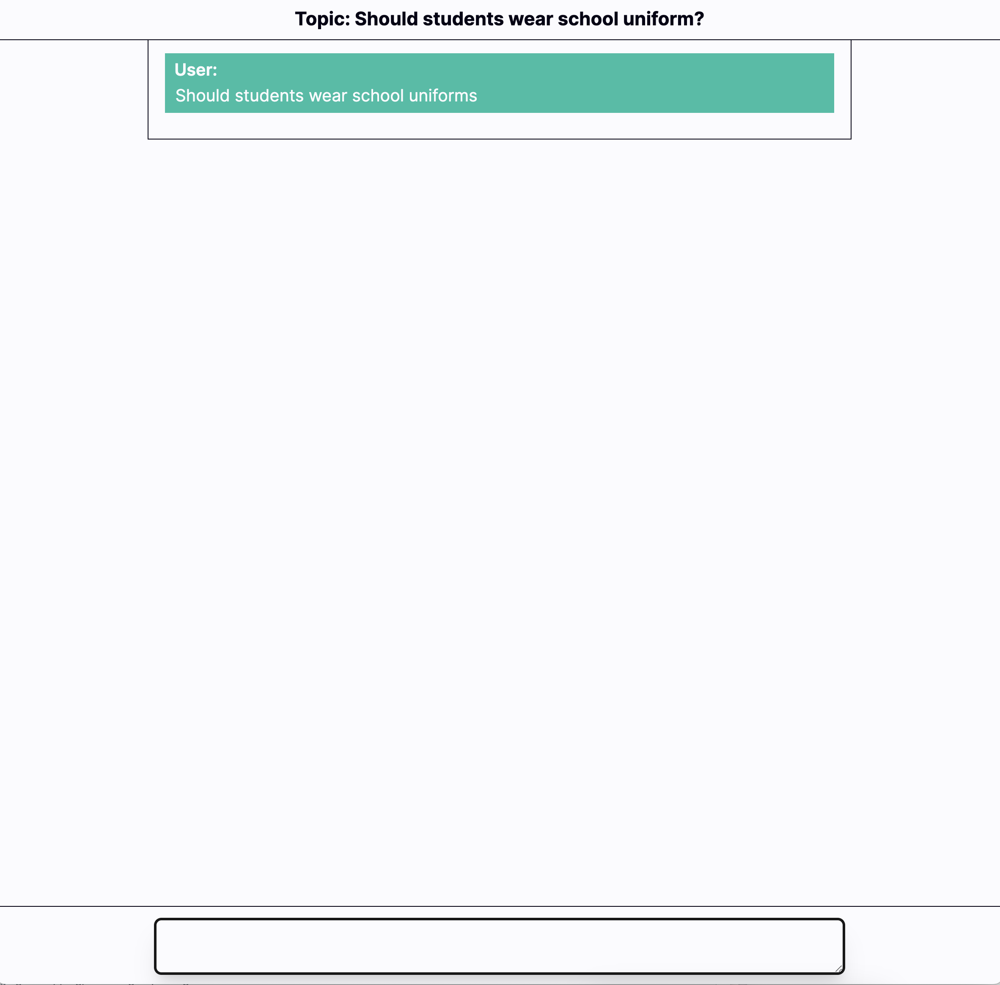
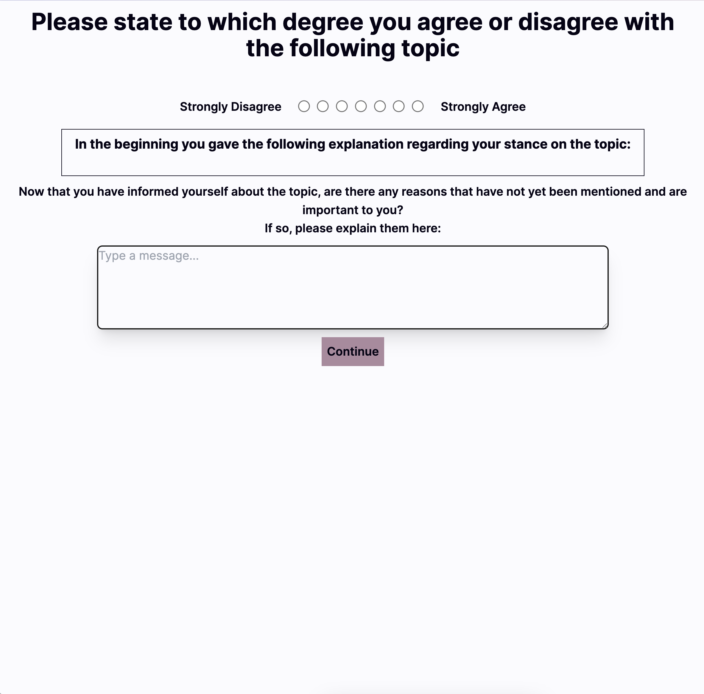

# RAG-Impact-UserAttitudes

[Study System](https://github.com/NoahMeissner/RAG-Impact-UserAttitudes/tree/System) 
[Statistical Analysis](https://github.com/NoahMeissner/RAG-Impact-UserAttitudes/tree/Statistical_Analyse)

### Abstract
In the field of information retrieval, search engine results pages (SERPs) have a significant impact on shaping user perceptions and knowledge acquisition.  The emergence of Retrieved Augmented Generation (RAG) systems represents a new avenue for knowledge dissemination. This study presents an analysis of the impact of opinion bias on user attitude change in the context of RAG Systems. A user study (n = 106) was conducted to evaluate the extent to which opinion bias influences users' attitude change. The results were contrasted with analogous research conducted on alternative information retrieval systems.  The empirical investigation shows that opinion bias has a negligible influence on user attitudes, indicating that RAG Systems are resilient to such biases. 

Study System was programmed in Cooperation with Felix Hornberger, Copy of that on the Branch [System](https://github.com/NoahMeissner/RAG-Impact-UserAttitudes/tree/System). Original on the Profile of [Felix Hornberger](https://github.com/FelixHornberger).

## System 
### Pre Task

### Pre Qualitative

### Scenario

### Chat

### Post Task

